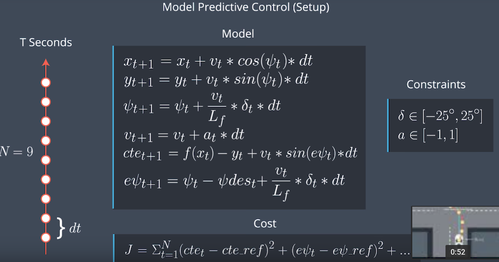

# Here is the explanation 

### 1. Student describes their model in detail. This includes the state, actuators and update equations.

#### What is MPC?
Model Predictive Control(MPC) uses an optimizer to find the control inputs that minimize the cost function. It means that vehicle can drive with a lowest cost trajectory to destination.<br /><br />
#### What is State Variables?
The code which in line 88~104 of 'mpc.cpp' define the state variable at time t and t+1.<br />
Consider the global coordinate system,<br />
x1,x0: the location in x-axis at time t+1 and t, respectively.<br />
y1,y0: the location in y-axis at time t+1 and t, respectively.<br />
psi1,psi0: heading angle at time t+1 and t, respectively.<br />
v1, v0: the speed at time t+1 and t, respectively.<br />
Later we will transform global coordination system to vehicle's local cooradinate system.<br /><br />
#### What is Actuator?
The code which in line 106~108 of 'mpc.cpp' define the actuator at time t.The code which in line 183~191 of 'mpc.cpp' define the lower and upper limits for actuator.<br />
delta0: steering value of vehicle to control the direction of vehicle. Consider the construction of wheels and recommondation of Udacity, I set the lower and upper limits delta angle from 25 to -25 degree which need to be converted as rad(radian) 0.436332 and -0.436332.<br />
a0: Throttle value of vehicle(we use throttle value represent both of throttle and brake value of vehicle in simulator). I set the lowr and upper limits throttle value from -1 to 1, (-1, 0) represent brake.<br /><br />
#### What is Update Equations?
The code which in line 119~125 of 'mpc.cpp' is the update equation of time t to t+1.<br /> Using _dt_, _N_, _previous state of vehicle_ and actuation value _a0_ and _delta0_.<br />
_'fg[ ]'_ is the cost, which need to be minimize close to 0, so base on equation(from udacity lesson) below, we can update t+1 every dt.<br />
<br /><br />


### 2. Student discusses the reasoning behind the chosen N (timestep length) and dt (elapsed duration between timesteps) values. Additionally the student details the previous values tried.

N is the number of timesteps in the horizon T( the duration over which future predictions are made), and dt is how much time elapses we will predict one time. T is the product of N and dt. If we want to look far, we need to increase T value by changing the product value of N and dt. <br />
The code which in line 13~14 of 'mpc.cpp' define N and dt value as 10 and 0.1. I set N=25 and dt=0.05 in first trial, the vehicle stopped when meet a bend/curve road, because the update time increase. So I decrease N value and increse dt value, N = 20 and dt = 0.1 in second trial, the vehicle speed is too slow when meet a bend/curve. So I increase N to 10 that can improve the update time, with trial-and-error I set N = 10 and dt = 0.1 in the end<br />

### 3. Polynomial Fitting and MPC Preprocessing

The code which in line 98~120 of 'main.cpp' is coordination transformation and polynomial fitting step.<br />
__Coordination transformation__ using rotation and translation matrix.<br />
__Polynomial fitting__ using function polyfit(). I used 3 order polynomial to fit x and y point becuase Udacity recommend using 3 order polynomial can achieve a good fit line of road. I will try using 2 or more than 3 order polynomial to fit road later, get the coefficients of fitting line.<br />

### 4. Model Predictive Control with Latency

In a real car, an actuation command will be a delay becuase of command propagation through the vehicle system, so we need to take the latency into account. A realitic delay might be about 100 milliseconds, which equal to dt(elapsed duraion between timesteps) which I set in the project, so I directly use the previous actuation as 'delta0' and 'a0'. 


```python

```
